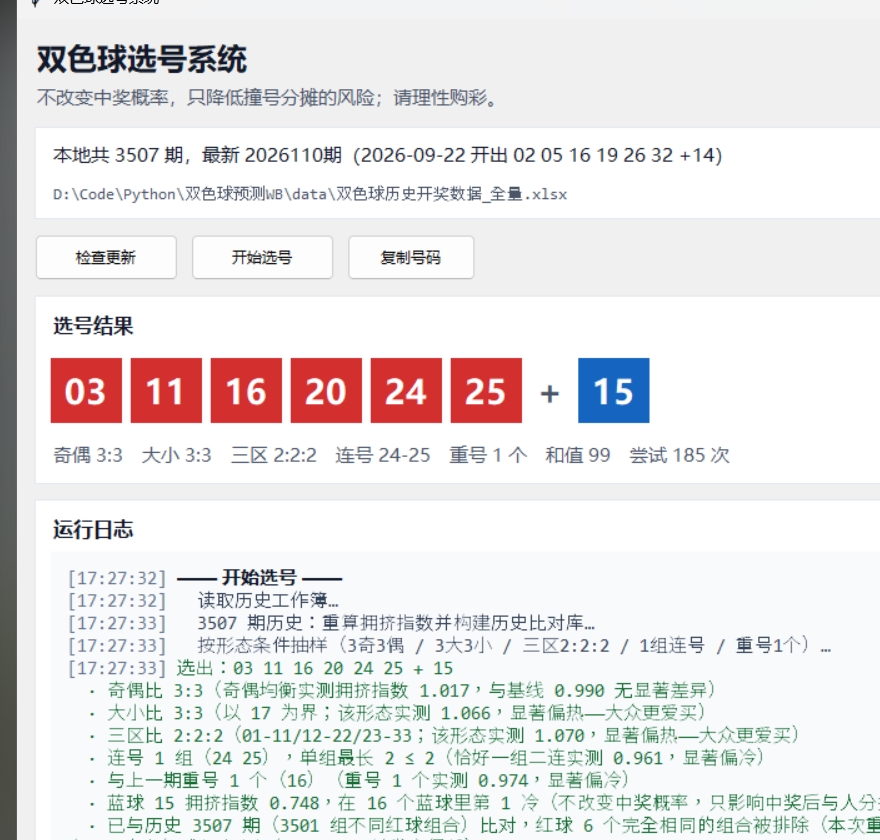

# 双色球数据分析与选号系统

一套跑在本机、**不联网也能用**的双色球历史数据分析工具：把 24 年的开奖数据读进来做结构校验与统计分析，
用「拥挤指数」反推大众的选号偏好，再按指定形态条件抽一注号码。

界面是 Tkinter 单窗口，也可以打包成一个免安装的 exe 直接发给别人用。



---

## ⚠️ 先看这一句

**这个程序不会提高中奖概率。** 每一注的中奖概率恒为 1/17,721,088，选号策略无法改变它。

它能做的只有一件事：**降低「和很多人买到同一组号、中了奖还要平分奖金」的概率**。
换句话说，它优化的是*分摊*，不是*概率*。而且只对一、二等奖（浮动奖金）有效——
三至六等奖是固定金额，完全不受影响；一等奖单注还有封顶。

**请理性购彩。**

---

## 它是怎么做的

### 1. 拥挤指数：用真实数据反推「大家都爱买什么号」

开奖结果是随机的，但**买的人是扎堆的**。同一期内，如果某个号码形态被很多人买了，
真开出来时中一等奖的人就多，奖金被摊薄。

所以可以用一个比率把它测出来：

```
拥挤指数 = Σ(该形态下的实际一等奖注数) ÷ Σ(该形态下的理论注数)
理论注数 = (当期销售额 ÷ 2) ÷ 17,721,088
```

- 指数 **> 1** → 这个形态买的人比均匀分布下更多（偏热）
- 指数 **< 1** → 买的人更少（偏冷）

这个比值跟"号码会不会开出来"没有任何关系，它衡量的是**别的购彩者的行为**。

### 2. 按形态条件选号

选号器抽的不是「热号」或「冷号」，而是一组**符合指定形态**的号码，
并且**排除历史上已经开出过的组合**。默认条件是：

| 条件 | 取值 |
|---|---|
| 奇偶比 | 3 奇 3 偶 |
| 大小比 | 3 大 3 小（01–16 小 / 17–33 大）|
| 三区比 | 2 : 2 : 2（01–11 / 12–22 / 23–33）|
| 连号 | 恰好 1 组，且为二连号（三连号不算）|
| 重号 | 与上一期恰好重合 1 个红球 |
| 蓝球 | 按 `1 / 拥挤指数` 加权，越冷门的号权重越高 |

拒绝采样：红球从全部 C(33,6) = 1,107,568 注里随机抽，不满足条件就重抽。
实测 **4,648** 注满足形态，排除 17 注历史撞号后剩 **4,631** 注候选，
命中率 **0.418%**，平均重抽 **239** 次（约 1.2 ms 出结果）。

---

## 分析结论（都用这份数据现算，不是写死的）

> 下表基于 **3,507 期**数据（2003-02-23 ~ 2026-09-22）。拥挤指数可用 **3,418** 期
> （2003 年整年 89 期销售额为 0，无法计算理论注数，已排除），全表基线 **0.990**。

### 号码分布是随机的吗

| 检验 | 卡方统计量 | 自由度 | p 值 |
|---|---|---|---|
| 红球出现次数均匀性 | 45.06 | 32 | **0.063** |
| 蓝球出现次数均匀性 | 8.88 | 15 | **0.884** |

红球的 p = 0.063 已经贴到 0.05 的边，属于**需要留意的边缘情形**，
但严格讲只能说「现有样本量下还看不出与均匀随机的差别」，
**不能**说成「分布与随机完全一致」，也**不能**据此认为存在可利用的规律。
蓝球 p = 0.884，看不出差别。红球和值均值 100.95（理论 102）。

### 形态出现的比例，和组合数学一致

| 形态 | 历史占比 | 组合数学预期 |
|---|---|---|
| 3 奇 3 偶 | 1,242 / 3,507 = 35.4% | 34.4% |
| 3 大 3 小 | 1,240 / 3,507 = 35.4% | 34.4% |
| 三区 2:2:2 | 541 / 3,507 = 15.4% | 15.0% |

**形态本身没有预测力**——它出现的频率就是纯组合数算出来的那个值。

### 大家偏爱哪些号（拥挤指数）

**蓝球，冷 → 热：**

| 冷 ← | | | | | | | | | | | | | | | → 热 |
|---|---|---|---|---|---|---|---|---|---|---|---|---|---|---|---|
| 15 | 14 | 01 | 16 | 02 | 13 | 03 | 04 | 05 | 11 | 10 | 06 | 07 | 08 | 12 | **09** |
| .748 | .763 | .770 | .804 | .811 | .870 | .911 | .965 | 1.003 | 1.081 | 1.085 | 1.104 | 1.171 | 1.183 | 1.265 | **1.376** |

呈「倒 U 型 + 9 吉利」双峰：中间段（06–12）明显偏热，两端（01–03、13–16）偏冷。

**红球形态：**

| 形态 | 指数 | 说明 |
|---|---|---|
| 含 32 或 33 | **0.848** | 偏冷——大众回避大号 |
| 全 ≤ 31 | 1.057 | 偏热 |
| 和值 ≥ 120 | **0.806** | 偏冷 |
| 和值 ≤ 100 | 1.061 | 偏热 |
| 3 连号及以上 | **1.119**（n=346）| 偏热——推翻了「大众避开连号」的直觉 |

**选号规则用到的 5 条形态：**

| 形态 | 指数 | n | 方向 |
|---|---|---|---|
| 3 奇 3 偶 | 1.017 | 1211 | 不显著 |
| 3 大 3 小 | **1.066** | 1211 | 偏热 |
| 三区 2:2:2 | **1.070** | 528 | 偏热 |
| 恰好一组二连 | **0.961** | 1512 | 偏冷 |
| 与上期重号 1 个 | **0.974** | 1494 | 偏冷 |

### 关于结论的边界，必须说清楚

上面 5 条里 **2 条偏热、2 条偏冷、1 条不显著**，合起来的整体方向**无法断言**。
所以这个项目对外只能说「按指定形态出号」，**不能说「帮你避开热门」**。
把 5 条全部叠加的形态历史上只出现过 16 期，指数 1.108，但 95% 置信区间是
[0.937, 1.279]，跨过 1，统计上不显著。

另一个量级感：2020 年之后，一等奖「独占」的期中位奖金约 1,000 万（n=33），
「≥5 注平分」的期中位约 691 万（n=749），**大约 1.45 倍**。这就是这套分析
全部的上限——不是让你更容易中奖，而是万一中了，少分点给别人。

---

## 获取代码

```bash
git clone https://github.com/zhengxinyu13/shuangseqiu-predictor.git
cd shuangseqiu-predictor
```

国内访问不畅时可用 Gitee 镜像，内容保持同步：

```bash
git clone https://gitee.com/Grayson_Zheng/shuangseqiu-predictor.git
```

---

## 快速开始

### 直接用打包好的 exe（推荐给不装 Python 的人）

向发布者索取打包好的压缩包，解压后双击 `ShuangseqiuPicker.exe`。
**不需要安装 Python，不需要联网**（只有「检查更新」按钮需要联网）。
目录版请把**整个文件夹**一起拷到别的电脑，缺了 `_internal` 会打不开。

### 从源码跑界面

界面依赖 `tkinter`（标准库）+ `openpyxl` + `httpx`，**不需要 numpy/scipy/matplotlib**：

```bash
pip install openpyxl httpx
python picker.py
```

### 生成完整分析报告

报告和测试需要科学计算栈：

```bash
pip install -r requirements.txt
python -m shuangseqiu.report
```

产出 `reports/双色球历史数据分析报告.html` 与同名 `.md`，
图表用仓库里自带的 `echarts.min.js`，**断网也能看**。

### 跑测试

```bash
python -m pytest
```

覆盖读取解析、结构校验、统计、拥挤指数、选号、增量更新、报告文案、
界面静态契约、打包与分发包组装。

### 检查数据更新

界面上的「检查更新」按钮会同时抓 **55128.cn** 与 **中国福彩官方 cwl.gov.cn**，
两边**逐列比对一致才写盘**，并回头用重叠期核对本地库。
任一处对不上就**整批拒绝写入**，并报出是哪一期的哪一列不一致——
宁可报错也不写脏数据。

---

## 打包成 exe 分发给别人

```bat
build_exe.bat            :: 目录版（推荐：启动快、杀软误报少）
build_exe.bat onefile    :: 单文件版（只有一个 exe，但启动要多等几秒解包）
```

脚本会自动创建独立的打包环境、调用 PyInstaller，最后用 `make_release.py`
把产物组装成可直接发出去的 zip。组装这一步不能省，也别手工压缩 `dist/`：

- `dist/` 会被**试运行污染**——双击一次 exe 就会在它旁边生成 `data/`，
  顺手压缩就把「已经跑过的状态」发给对方了。`make_release.py` 会剔除它，
  并在组装完成后断言顶层不存在 `data/`；
- 目录版的 `_internal/data/` 是程序**自带的数据种子，必须保留**，
  少了它首次运行就没数据可释放（和上一行只差一个字，一个多发一个漏发，
  所以配了守门测试）；
- 两种形态会配**不同的使用说明**：目录版必须整个文件夹一起拷，
  单文件版只有一个 exe。写反了对方就卡在第一步。

打包后务必在**一个干净目录**里试一次，模拟「拷到别人电脑」——原地（仓库里）
跑永远发现不了路径问题，因为仓库里本来就有 `data/`。要验证的是四件事：

1. 没有 `data/` 的干净目录里能启动；
2. 窗口真的画出来（不是只看「进程还活着」，界面起不来时进程可能照样在）；
3. exe 旁边释放出来的数据与仓库那份**逐字节一致**；
4. 第二次启动**不覆盖**用户已有数据。

（打包用的是 PyInstaller 的目录版形态，注意历史坑：冻结后数据目录**不能**再按
`__file__` 推算——它指向解包用的临时目录，退出即删，写进去的期号会**无声消失**。
本项目用 `application_root()` 在冻结时改取 `sys.executable` 所在目录。）

> **一个时间窗口要注意**：打包时会把当期的历史数据作为种子一起打进程序，
> 首次运行自动释放。但增量更新依赖的两个数据源里，55128.cn 只保留最近 80 期，
> 所以**发出去的包搁置超过约半年（80 期）再第一次运行**，「检查更新」可能因
> 最老的缺期落在窗口外而无法补齐。选号仍然可用，只是数据停在旧期号。
> 超过半年建议重新打包再发。

---

## 项目结构

```
shuangseqiu/              核心库（与界面完全解耦）
├── data.py               工作簿读取解析、路径解析、种子数据释放
├── dataset.py            整本工作簿读写、派生字段重算、形态判定工具
├── quality.py            结构诊断（期号连续性、取值范围、开奖日规律…）
├── stats.py              频次、遗漏、和值、跨度、卡方检验、年度汇总
├── crowding.py           拥挤指数（本项目的核心分析）
├── selector.py           选号器（形态条件 + 拒绝采样 + 历史排除）
├── updater.py            增量更新（双源抓取 + 逐列交叉校验）
├── charts.py             matplotlib 出图
└── report.py             渲染 HTML + Markdown 报告

picker.py                 图形界面（Tkinter）
run_picker.bat            界面启动入口
build_exe.bat / .spec     打包定义
make_release.py           组装可分发压缩包
tests/                    pytest 测试
reports/                  分析报告与图表
data/                     历史开奖数据工作簿
```

### 为什么依赖要分成两条链

| 链 | 入口 | 依赖 |
|---|---|---|
| 界面 | `picker.py` | `tkinter` + `openpyxl` + `httpx` |
| 报告 / 测试 | `shuangseqiu.report`、`pytest` | 再加 `numpy` + `scipy` + `matplotlib` |

界面只 import `data` / `dataset` / `selector` / `updater`，**完全不碰** `stats` / `charts` / `report`。
这样截图、跑界面、打包都不必背上科学计算栈，打出来的 exe 才能压到 30 MB。
`tests/test_ui_contract.py` 用 `ast` 静态解析守住这条边界：一旦界面代码里出现
`numpy` 之类的 import，测试立刻就会红。

（`tkinter` 属于标准库，但**并非所有 Python 发行版都自带**，例如部分精简安装和虚拟环境就没有。
打包时必须用带 `tkinter` 的解释器，否则收不进 tcl/tk。）

---

## 数据来源

历史开奖数据来自公开渠道，并做过三源交叉校验：主源 17500.cn（乐彩网），
校验源 500.com 与中国福彩官方 `cwl.gov.cn` 接口。3,507 期全部通过结构校验，零剔除。

历史开奖信息属于公开事实性数据，版权归原发布方所有；本项目仅做整理与分析。

---

## 许可证

[MIT](LICENSE) © 2026 Grayson Zheng

---

> 本项目为个人兴趣的分析与工程实践，与任何彩票发行机构无关。
> 彩票是负期望值的娱乐消费，请量力而行。
