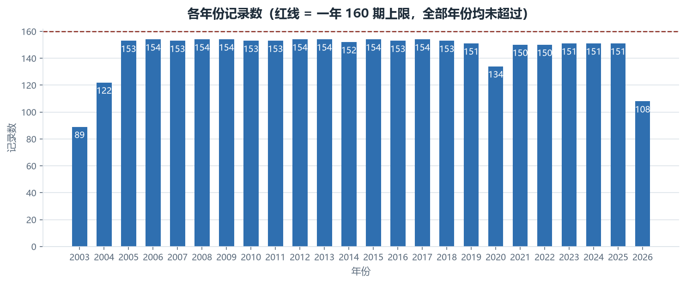
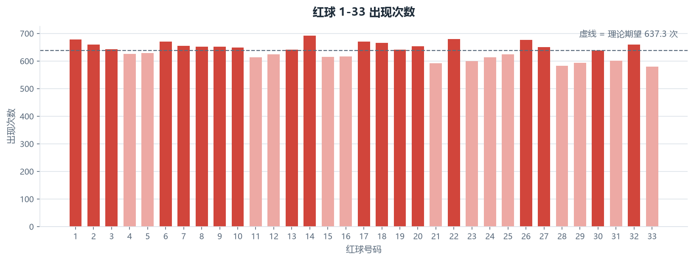
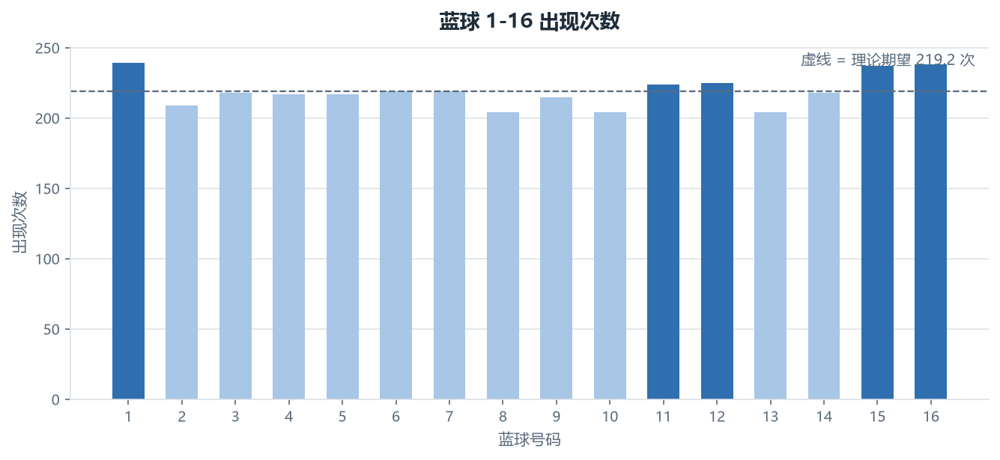
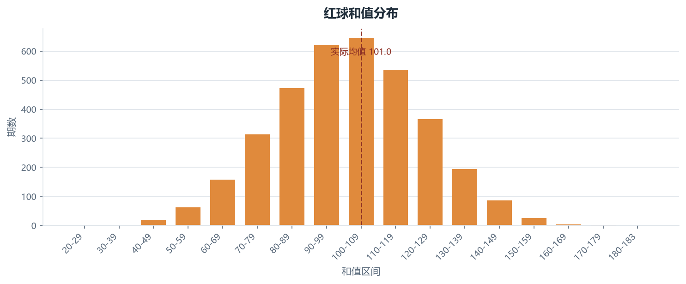
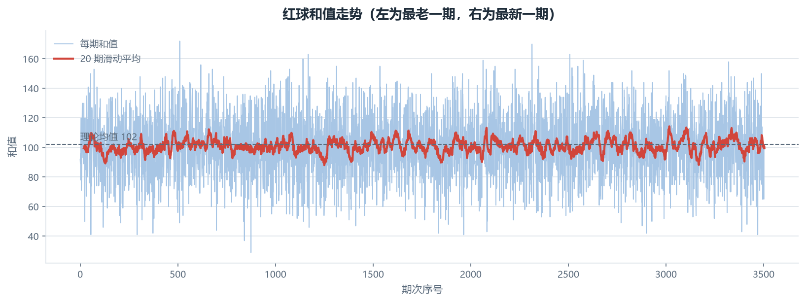
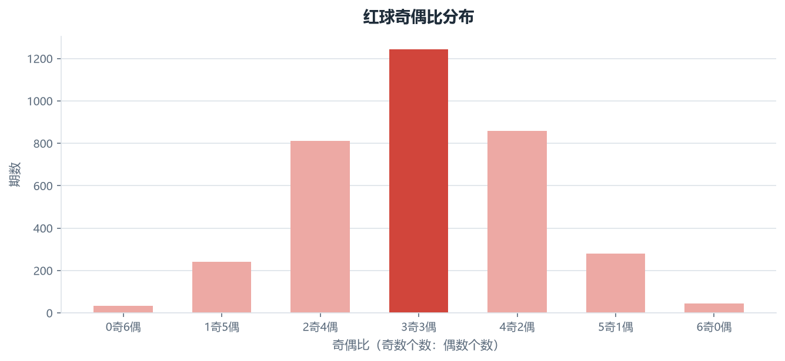
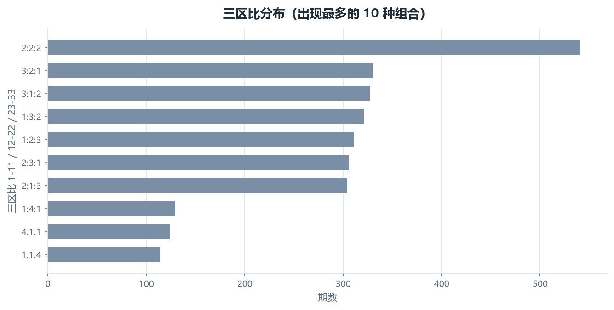
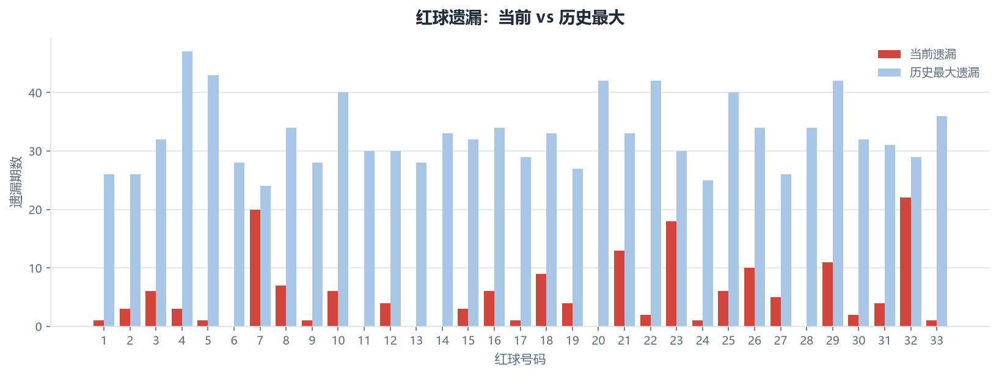
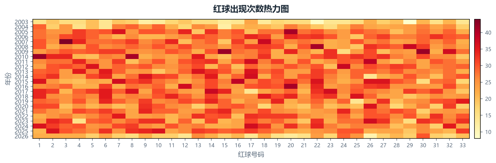

# 双色球历史开奖数据分析报告

> 数据源：`data/双色球历史开奖数据_全量.xlsx` ｜ 记录 3505 期
> ｜ 参与分析 3505 期 ｜ 生成时间 2026-09-20 17:29

## 一、先看结论

1. **这份数据可以用。** 3505 期记录全部通过结构校验：没有任何一年的期数
   越过物理上限（一年最多 160 期），3505 期完整覆盖
   2003–2026 年，中间没有断档。年内序号、开奖日、派生列、
   口径四项的逐项核查见第二节。
2. **号码分布的随机性检验。** 红球方面，p = 0.063 已贴近常用的 0.05，属于需要留意的边缘情形；严格说只能讲「现有样本量下还没看出与均匀随机的差别」，而不是「分布与随机毫无差别」；
   蓝球方面，p = 0.882 明显高于 0.05，看不出与均匀随机的差别。"热号""冷号"的差距即便存在，
   也不构成可用的选号信号。
3. **形态分布同样贴合理论。** 和值实际均值 100.95，理论均值
   102，相差 1.05。

> 彩票每期独立开奖，历史号码对未来一期没有信息量。本报告描述这份数据本身，
> 不构成任何选号依据。

## 二、数据来源与校验

正表以**乐彩网（17500.cn）**全量文本为主数据源，另取两路独立数据逐期比对：
**500.com** 全量历史，以及**中国福利彩票官网 API**（官方仅提供 2013 年起数据）。
两路校验源与主源在红球、蓝球、开奖日期上逐期一致，零冲突。

> 用户最初指定的 55128.cn 经比对发现系统性缺陷，**未采用**：缺 2006008 期、
> 13 期号码错误、2003–2004 年共 209 期开奖日期错误。日期错误会让时间序列与周期性
> 分析整体偏移，因此该站只作差异登记，不进正表。

结构校验的判据全部来自数据自身：一年最多 53 个周二 + 53 个周四 + 53 个周日 = 159 期，
放宽 1 期取 **160** 作为阈值，超过即判该年份不可信。

| 年份 | 记录数 | 最小编号 | 最大编号 | 年内缺口 | 判定 |
| --- | --- | --- | --- | --- | --- |
| 2003 | 89 | 1 | 89 | — | 纳入分析 |
| 2004 | 122 | 1 | 122 | — | 纳入分析 |
| 2005 | 153 | 1 | 153 | — | 纳入分析 |
| 2006 | 154 | 1 | 154 | — | 纳入分析 |
| 2007 | 153 | 1 | 153 | — | 纳入分析 |
| 2008 | 154 | 1 | 154 | — | 纳入分析 |
| 2009 | 154 | 1 | 154 | — | 纳入分析 |
| 2010 | 153 | 1 | 153 | — | 纳入分析 |
| 2011 | 153 | 1 | 153 | — | 纳入分析 |
| 2012 | 154 | 1 | 154 | — | 纳入分析 |
| 2013 | 154 | 1 | 154 | — | 纳入分析 |
| 2014 | 152 | 1 | 152 | — | 纳入分析 |
| 2015 | 154 | 1 | 154 | — | 纳入分析 |
| 2016 | 153 | 1 | 153 | — | 纳入分析 |
| 2017 | 154 | 1 | 154 | — | 纳入分析 |
| 2018 | 153 | 1 | 153 | — | 纳入分析 |
| 2019 | 151 | 1 | 151 | — | 纳入分析 |
| 2020 | 134 | 1 | 134 | — | 纳入分析 |
| 2021 | 150 | 1 | 150 | — | 纳入分析 |
| 2022 | 150 | 1 | 150 | — | 纳入分析 |
| 2023 | 151 | 1 | 151 | — | 纳入分析 |
| 2024 | 151 | 1 | 151 | — | 纳入分析 |
| 2025 | 151 | 1 | 151 | — | 纳入分析 |
| 2026 | 108 | 1 | 108 | — | 纳入分析 |

除期数上限外，以下四条也一并核查：

- **年内序号**：24 个年份全部自 001 起连续编号，零缺号。各年期数落在 89–154 期之间，
  早期年份偏少是开奖频率演变的结果——2003 年只在周四、周日开奖，2004 年 8 月 24 日
  （2004067 期）起加开周二，此后固定为每周三期（可查数据「开奖日期」「星期」两列）。
- **开奖日**：3505 期全部落在周二 / 周四 / 周日，且「星期」列与开奖日期的
  真实日历逐期吻合。
- **派生列自洽**：和值、跨度、奇偶比、大小比、三区比、连号六列，全部能由 6 个红球重算得到一致结果。
- **口径统一**：大小号按 01–16 为小、17–33 为大；三区按 01–11 / 12–22 / 23–33 划分。

## 三、数据概览

数据跨越 24 个年份（2003–2026），
共 3505 期、24535 个球，其中红球 21030 个、
蓝球 3505 个。

> 样本量提醒：33 选 6 共 1 107 568 种组合，再乘蓝球 16 种，全部组合
> 17 721 088 种。用 3505 期覆盖这个空间，只看到极稀疏的一小片。

## 四、号码频率

| 类别 | 红球 | 出现次数 | 相对期望 |
| --- | --- | --- | --- |
| 偏热 | 14 | 691 | +53.7 |
| 偏热 | 22 | 679 | +41.7 |
| 偏热 | 01 | 678 | +40.7 |
| 偏热 | 26 | 676 | +38.7 |
| 偏热 | 06 | 670 | +32.7 |
| 偏热 | 17 | 670 | +32.7 |
| 偏冷 | 33 | 579 | -58.3 |
| 偏冷 | 28 | 583 | -54.3 |
| 偏冷 | 21 | 592 | -45.3 |
| 偏冷 | 29 | 594 | -43.3 |
| 偏冷 | 23 | 600 | -37.3 |
| 偏冷 | 31 | 601 | -36.3 |

| 蓝球 | 出现次数 | 相对期望 |
| --- | --- | --- |
| 01 | 239 | +19.9 |
| 16 | 238 | +18.9 |
| 15 | 237 | +17.9 |
| 12 | 225 | +5.9 |
| 11 | 224 | +4.9 |
| 07 | 219 | -0.1 |
| 03 | 218 | -1.1 |
| 06 | 218 | -1.1 |
| 04 | 217 | -2.1 |
| 05 | 217 | -2.1 |
| 14 | 217 | -2.1 |
| 09 | 215 | -4.1 |
| 02 | 209 | -10.1 |
| 08 | 204 | -15.1 |
| 10 | 204 | -15.1 |
| 13 | 204 | -15.1 |

## 五、形态特征

实际和值区间 29–172，均值 100.95，
理论均值 102。

20 期滑动平均始终围绕理论均值摆动，没有趋势性。

| 形态 | 出现最多的组合 | 期数 | 占比 |
| --- | --- | --- | --- |
| 奇偶比 | 3奇3偶 | 1241 | 35.4% |
| 大小比 | 3大3小 | 1238 | 35.3% |
| 三区比 | 2:2:2 | 540 | 15.4% |
| 连号 | 1 组连号 | 1834 | 52.3% |
| 与上期重号 | 1 个重号 | 1526 | 43.5% |

## 六、遗漏与随机性检验

卡方检验结果：

| 项目 | 卡方统计量 | 自由度 | p 值 |
| --- | --- | --- | --- |
| 红球 | 45.02 | 32 | **0.063** |
| 蓝球 | 8.91 | 15 | **0.882** |

红球方面，p = 0.063 已贴近常用的 0.05，属于需要留意的边缘情形；严格说只能讲「现有样本量下还没看出与均匀随机的差别」，而不是「分布与随机毫无差别」；
蓝球方面，p = 0.882 明显高于 0.05，看不出与均匀随机的差别。

> p 值不是"号码是随机的概率"，而是"如果号码真的均匀随机，出现当前这么偏的
> 分布的概率有多大"。红球 p = 0.063 意味着：即使摇奖完全公平，
> 也有约 6.3% 的机会出现当前这种程度的偏斜。

颜色深浅没有形成纵向条纹，说明不存在"某几年偏爱某些号码"的稳定模式。
期数偏少的年份有 2003 年（89 期）、2004 年（122 期）、2020 年（134 期）、2026 年（108 期），那几行颜色天然偏浅，只有横向比较才有意义。

## 七、结论与边界

- **对数据本身**：这份表已通过三源交叉校验与结构自洽校验，可以当作
  2003 年至今的完整开奖历史使用——3505 期全部进入分析，
  没有需要剔除的部分。
- **对分析结论**：号码频率、和值、奇偶比、大小比、三区比、连号、
  重号等指标都没有呈现出可复现的规律；频率层面的检验结果见第六节。
- **能力边界**：任何声称能根据历史号码预测下一期的方法，都要先解释为什么它能在
  p = 0.063 这种级别的均匀性上找到信号。后续建模目标应放在
  "验证随机性"而不是"预测号码"。

---

*本报告由脚本自动生成，数据源与计算过程见项目仓库 `shuangseqiu/` 目录。*
